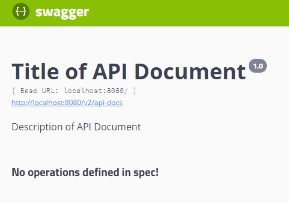

# Swagger


参考：

[Swagger介绍及使用 - 简书 (jianshu.com)](https://www.jianshu.com/p/349e130e40d5)

[Swagger - 简书 (jianshu.com)](https://www.jianshu.com/p/a0caf58b3653)

[SpringMVC注解配置Swagger2步骤及相关知识点_z28126308的专栏-CSDN博客](https://blog.csdn.net/z28126308/article/details/71126677)

[Swagger 常用注解使用详解_wyb880501的博客-CSDN博客_swagger注解](https://blog.csdn.net/wyb880501/article/details/79576784)

解决了引入WebMvc之后访问不到静态页面的问题

[一步步完成Maven+SpringMVC+SpringFox+Swagger整合示例 - 王孟君的个人空间 - OSCHINA - 中文开源技术交流社区](https://my.oschina.net/wangmengjun/blog/907679)

[swagger-ui 系统配置过程（基于spring+springmvc+swagger+springfox配置 web-api 管理系统） - v海神与小周 - 博客园 (cnblogs.com)](https://www.cnblogs.com/hailongchen/p/8262027.html)

[@EnableWebMvc 注解会让Swagger无效访问的问题 - 少年喝了这个java吧 - 博客园 (cnblogs.com)](https://www.cnblogs.com/h-java/p/10270567.html)


## 1.废话

前后端分离，API接口变成前后端的唯一联系，API文档联系了前后端开发人员

> Swagger 是一个规范和完整的框架，用于生成、描述、调用和可视化 RESTful 风格的 Web 服务。总体目标是使客户端和文件系统作为服务器以同样的速度来更新。文件的方法，参数和模型紧密集成到服务器端的代码，允许API来始终保持同步。

具体的作用就是

> *1.自动生成API文档*
>
> *2.测试API功能*

 **Swagger是一组开源项目，其中主要要项目如下：**

1. **Swagger-tools**:提供各种与Swagger进行集成和交互的工具。例如模式检验、Swagger 1.2文档转换成Swagger 2.0文档等功能。

2. **Swagger-core**: 用于Java/Scala的的Swagger实现。与JAX-RS(Jersey、Resteasy、CXF...)、Servlets和Play框架进行集成。

3. **Swagger-js**: 用于JavaScript的Swagger实现。

4. **Swagger-node-express**: Swagger模块，用于node.js的Express web应用框架。

5. **Swagger-ui**：一个无依赖的HTML、JS和CSS集合，可以为Swagger兼容API动态生成优雅文档。

6. **Swagger-codegen**：一个模板驱动引擎，通过分析用户Swagger资源声明以各种语言生成客户端代码。


## 2.使用

### 1.Maven-POM文件

```xml
<!--swagger-api 依赖开始-->
<dependency>
    <groupId>io.springfox</groupId>
    <artifactId>springfox-swagger2</artifactId>
    <version>2.7.0</version>
</dependency>

<dependency>
    <groupId>io.springfox</groupId>
    <artifactId>springfox-swagger-ui</artifactId>
    <version>2.7.0</version>
</dependency>

<dependency>
    <groupId>com.fasterxml.jackson.core</groupId>
    <artifactId>jackson-databind</artifactId>
    <version>2.6.6</version>
</dependency>
<!--swagger-api 依赖结束-->
```

### 2.Swagger配置类

```java
@Configuration
@EnableSwagger2
//@EnableWebMvc	在没有配置WebMvc时不要用，而一般来说@EnableWebMvc也不写在配置类上，会导致Mvc配置完全接手SpringMvc配置，详见参考
public class SwaggerConfig{
    @Bean
    public Docket docket(){
        return new Docket(DocumentationType.SWAGGER_2)
                .apiInfo(apiInfo())
                .select()
                .apis(RequestHandlerSelectors.basePackage("com.tank.cdi.controller"))
                .paths(PathSelectors.any())
                .build();
    }

    public ApiInfo apiInfo(){
        return new ApiInfoBuilder()
                .title("Title of API Document")	//API文档标题
                .description("Description of API Document") //API文档描述
                .termsOfServiceUrl("")	
                .version("1.0")
                .build();
    }
}

//设置联系方式
//private Contact contact() {
//        return new Contact("Wilson", "http://blog.csdn.net/z28126308", "z28126308@163.com");
//    }
```

swagger-ui.html效果图：


### 3.×××Controller

一个测试API，如下

```java
@Api(value="用户模块")
@RestController
public class UserController {

    //模拟一个数据库
    //class User {String username; String password;}
    public static ArrayList<User> users = new ArrayList<>();
    static {
        users.add(new User("xiaoming", "123456"));
        users.add(new User("xiaoliu", "123"));
    }

    @ApiOperation(value = "获取用户列表",notes = "获取所有用户的信息")
    @ResponseBody
    @GetMapping("/users")
    public Object index() {
        HashMap<String, List> map = new HashMap<>();
        map.put("users", users);
        return users;
    }

    @ApiOperation(value = "根据用户ID查询用户",notes = "查询单个用户的信息")
    @ApiImplicitParam(name = "id",value = "用户ID",dataType = "int",paramType = "path")
    @ResponseBody
    @GetMapping("/users/{id}")
    public Object getUserById(@PathVariable("id") String id) {
        int uid = Integer.parseInt(id);
        return users.get(uid);
    }

    @ApiOperation(value = "添加用户")
    @ApiImplicitParam(value = "用户类")
    @ResponseBody
    @PostMapping("/user")
    public Object add(User user) {
        System.out.println(user);
        return users.add(user);
    }

    @ApiOperation(value="删除用户", notes="根据url的id来指定删除对象")
    //@ApiResponse(code = 400,message = "参数没有填好",response = String.class)
    @DeleteMapping(value="/users/{id}")
    public void delete(@PathVariable int id) {
        users.remove(id);
    }
}
```

至此，在swagger-ui.html页面就可以对API进行在线的测试


### 4.注解

```java
@API(value = "")	//用来标识API，value对接口的作用进行描述
@ApiOperation(value="", notes="")	//标识在API方法上，value描述方法功能，notes是详细描述
@ApiImplicitParams	//标识一组参数，由若干@ApiImplicitParam组成
@ApiImplicitParam(name="", value="", dataType="", paramType="")	//标识方法的请求参数（输入参数），详见下
@ApiResponse(code = 400, message = "", response = .class())	//标识一个响应信息，一般用来表达一个错误的响应，code是一个int类似状态码，message是错误信息，response指抛出异常的类

@ApiModel	//可以把对象当作一个传入参数，详见参考
@ApiModelPropertiy
```

@ApiImplicitParam详情

- name-参数名

- value-参数的含义描述

- required-是否必须 true or false

- dataType-参数的数据类型，只作为标志说明，没有实际验证

  - 可选类型有Long, String

- paramType-查询参数的类型

  ​	-path 以地址形式提交数据

  ​	-query 直接跟参数完成自动映射赋值

  ​	-body 以流的形式提交，仅支持POST

  ​	-header 参数在request header提交

  ​	-former 以former表单形式提交，仅支持POST

上面的示例中：

```java
@ApiImplicitParam(name = "id",value = "用户ID",dataType = "int",paramType = "path")
//注意参数 id 的传入方式
public Object getUserById(@PathVariable("id") String id){
    ……
```


## 3.引入WebMvc

引入WebMvc后需对Mvc进行配置，重新定位静态资源，否则会导致swagger-ui.html访问不到

```java
//WebMvc配置
@Configuration
public class WebMvcConfig extends WebMvcConfigurationSupport {
    @Override
    public void addResourceHandlers(ResourceHandlerRegistry registry) {
        registry.addResourceHandler("swagger-ui.html")
                .addResourceLocations("classpath:/META-INF/resources/");

        registry.addResourceHandler("/webjars/**")
                .addResourceLocations("classpath:/META-INF/resources/webjars/");
    }
}
```

