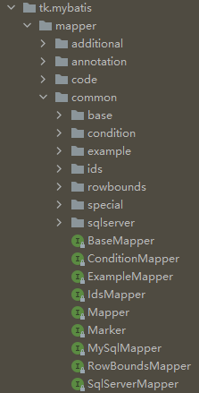

# MyBatis


## 1.简介

> MyBatis 是一款优秀的持久层框架，它支持定制化 SQL、存储过程以及高级映射。
>
> MyBatis 避免了几乎所有的 JDBC 代码和手动设置参数以及获取结果集。
>
> MyBatis 可以使用简单的 XML 或注解来配置和映射原生信息，将接口和 Java 的 **POJOs(Plain Ordinary Java Object，普通的 Java对象)**映射成数据库中的记录。

ps：持久层，又被称为数据访问层，进行数据读取和传递


Mapper是一个可以实现任意MyBatis通用方法的框架，通过mapper可以解决大多数MyBatis的基本操作


## 2.使用

Method 1：

- [ ] 在xml配置文件对数据库进行配置
- [ ] 在mapper.xml中映射Sql语句和对数据库进行CRUD的函数

……

这样的方法比较繁琐，有很多的配置文件和手写的数据库操作


Method 2(推荐)：

- [ ] 写一个MyMapper接口继承TKMyBatis中的Mapper<>和MySqlMapper<>
- [ ] 每一个新建实体的Mapper都作为MyMapper的子接口

……

Mapper<>和MySqlMapper<>中有许多已经封装好的CRUD操作

（有关TKMyBatis，详见后）


#### Java API

相比于JDBC，可以大幅简化代码

SqlSession()

SqlSessionFactory()

（暂时没用上）


#### MyBatis逆向工程

自动生成Service和DAO层文件（暂时没用上）


## 拓展：TKMyBatis


参考：

[【Mybatis】TKMybatis 介绍和使用_AldarLin的博客-CSDN博客_tk.mybatis](https://blog.csdn.net/qq_34416331/article/details/106322596)

[TkMybatis的常用方法介绍 - 掘金 (juejin.cn)](https://juejin.cn/post/6844903829553709069)


### 1.TKMyBatis

> TKMybatis 是基于 Mybatis 框架开发的一个工具，内部实现了对单表的基本数据操作，只需要简单继承 TKMybatis 提供的接口，就能够实现无需编写任何 sql 即能完成单表操作。


### 2.使用

#### 1.新的类

> Example

Example是MyBatis框架中的一个工具，一个Example实际上就是对应着一个实体集

Example两个常用的参数`orderByClause`和`distinct`，用例如下

```java
Example example = new Example(User.class);	//创建一个User实体集样例
example.orderByClause("age asc")	//参数格式："property asc/desc"，按照某一属性升序/降序排序
example.distinct(false);	//去重(true)，不去重(false)
```


> Criteria

Criteria是Example的一个内部类，主要用来对定义SQL语句中where后面的查询条件

常见的操作

```java
Example example = new Example(User.class);
Example.Criteria criteria = example.createCriteria();

criteria.andNull("property");
criteria.andNotNull("property");

criteria.andEqualTo("property", value);
criteria.andGreaterThan("property", value);	//属性值大于value
criteria.andGreaterThanOrEqualTo("property", value);
criteria.andLessThan("property", value);	//属性值小于value
criteria.andLessThanOrEqualTo("property", value);

criteria.andBetween("property", value1, value2);
criteria.andNotBetween("property", value1, value2);

//模糊查询
criteria.andLike("property", "%" + value + "%");
criteria.andNotLike("property", "%" + value + "%");

//先别用，没搞懂
criteria.andIn("property", List<T>);
criteria.andNotIn("property", List<T>);
```


#### 实体集的定义

- 类定义处加@Table指明是一个表
- 表的名称默认使用类名（驼峰转下划线），建议直接用`@Table(name = "")`指定，@Column定义相同


#### 继承Mapper后的CRUD

在DAO层的mapper文件中继承相应的接口，Service层就可以调用已经封装好的一系列单表操作

常用的操作

```java
//增加
Mapper.insert(record);	//保存一个实体，null的属性也会保存，不会使用数据库默认值
Mapper.insertSelective(record);	//保存一个实体，忽略空值，即没提交的值会使用使用数据库默认值

//删除
Mapper.delete(record);	//根据实体属性作为条件进行删除，查询条件使用等号
Mapper.deleteByExample(example);	//根据Example条件删除数据
Mapper.deleteByPrimaryKey(key);	//根据主键字段进行删除，方法参数必须包含完整的主键属性

//修改
Mapper.updateByPrimaryKey(record);	//根据Example条件更新实体record包含的全部属性，null值会被更新
Mapper.updateByPrimaryKeySelective(record); //根据Example条件更新实体record包含的不是null的属性值
Mapper.updateByPrimaryKey(record);	//根据主键更新实体全部字段，null值会被更新
Mapper.updateByPrimaryKeySelective(record);	//根据主键更新属性不为null的值

//查询
Mapper.select(record);	//根据实体中的属性值进行查询，查询条件使用等号
Mapper.selectAll();	//查询全部结果
Mapper.selectByExample(example);	//根据Example条件进行查询
Mapper.selectByPrimaryKey(key);	//根据主键字段进行查询，方法参数必须包含完整的主键属性，查询条件使用等号
Mapper.selectCount(record);	//根据实体中的属性查询总数，查询条件使用等号
Mapper.selectCountByExample(example);	//根据Example条件进行查询总数
Mapper.selectOne(record);	//根据实体中的属性进行查询，只能有一个返回值，有多个结果是抛出异常，查询条件使用等号

```


#### 其他的接口




